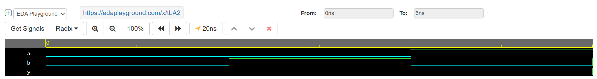

# Day 08 – AND Gate Using Only NAND Gates

## 🧠 Topic
Design and simulation of a 2-input **AND gate implemented using only NAND gates** in Verilog.

## 🔧 Toolchain
- **Simulation Tool:** Cadence Xcelium 23.09
- **Platform:** [EDA Playground](https://edaplayground.com)
- **Language:** Verilog HDL

## 📌 Objectives
- Understand the universality of NAND gates in digital logic design.
- Implement an AND gate using NAND gates.
- Simulate the design and verify its functionality using testbench-driven waveform analysis.

## ✅ Summary
This project demonstrates the use of **NAND gates to construct an AND gate**, confirming how universal gates can replicate basic logic functions. The simulation includes:
- All four input combinations (00, 01, 10, 11)
- Functional verification through waveform outputs and terminal monitoring

## 🔗 Links
- ▶️ **EDA Playground Simulation**: [Click here to run](https://edaplayground.com/x/tLA2)  
- 📁 **GitHub Repository**: [Verilog-Streak on GitHub](https://github.com/MitanshiGaur/Verilog-Streak)

## 📷 Output Snapshots
### Waveform Viewer

## 🏁 Next Steps
Explore more gate-level implementations and begin transitioning into combinational circuits using Verilog.
