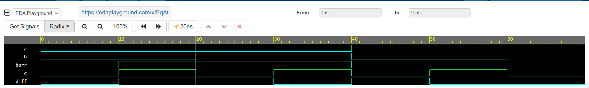

# Day 16 – Full Subtractor Design Using Basic Logic Gates

## 🧠 Topic
Full Subtractor Design Using Basic Logic Gates

## 🔧 Tool Used
Cadence Xcelium on EDA Playground

## 📌 What I Did
- Designed the `diff` (difference) output using XOR operations  
- Generated the `borr` (borrow) output using AND, OR, and NOT gates  
- Created a testbench to verify all 8 input combinations  
- Validated the results via simulation log and waveform  

## 💡 Learning Highlight
The Full Subtractor determines the difference of two bits with a borrow-in, producing both a difference and borrow-out.  
It’s a critical component in arithmetic logic for subtraction operations in processors.

## 📊 Observation
- `diff` is **1** when the number of high inputs among `a`, `b`, and `bin` is odd  
- `borr` is **1** when the subtraction requires borrowing from the next higher bit  

The waveform and simulation log perfectly matched the theoretical truth table.

## 🔗 Explore More
- **EDA Playground:** [https://edaplayground.com/x/XXXX](https://edaplayground.com/x/XXXX)  
- **GitHub Repo:** [https://github.com/mitanshigaur/verilog-coding-streak](https://github.com/mitanshigaur/verilog-coding-streak)

---

### 📷 Waveform & Simulation

