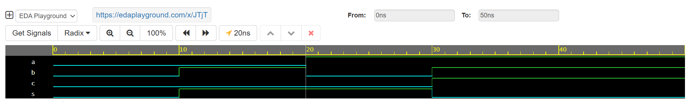

# Day 15 — Half Adder in Verilog

## 🧠 Topic
**Half Adder Implementation in Verilog**

## 🔧 Tool Used
Cadence Xcelium on [EDA Playground](https://edaplayground.com/x/JTjT)

---

## 📌 What I Did
- ✅ Implemented a Half Adder using Verilog (`XOR` for sum, `AND` for carry)  
- ✅ Built a testbench to verify all possible input combinations  
- ✅ Simulated and verified results via waveform and simulation logs  

---

## 💡 Learning Highlight
The Half Adder is a fundamental combinational logic circuit that demonstrates how simple logic gates (`XOR` and `AND`) can perform binary addition without carry-in.

---

## 📊 Observation
- **Sum (`s`)** = `a ⊕ b` → High when inputs differ  
- **Carry (`c`)** = `a ∧ b` → High only when both inputs are 1  
Simulation outputs and waveforms match the expected truth table perfectly.

---

## 📷 Waveform

---

## 🔗 Explore More
- **EDA Playground Link:** [Click Here](https://edaplayground.com/x/JTjT)  
- **GitHub Repo:** [Verilog Coding Streak](https://github.com/mitanshigaur/verilog-coding-streak)  

---

## 🏷️ Tags
#Verilog #VLSI #DigitalDesign #RTLdesign #FPGA #EDA #HardwareDesign #Adder #HalfAdder #Cadence #Xcelium #EDAPlayground #CodingStreak #LogicGates #Semiconductor
