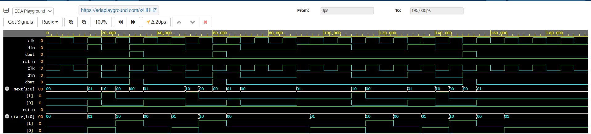

# 🔌 Day 35 – Mealy FSM: "101" Sequence Detector (Non-Overlapping)

This is Day 35 of my **Verilog Coding Streak**, where I design, simulate, and analyze digital logic modules daily using **EDA Playground** with **Cadence Xcelium 23.09**.

## 📘 What I Built

A **Mealy Finite State Machine (FSM)** that detects the binary sequence **"101"** from a serial input stream.
This implementation is **non-overlapping**, meaning once the sequence is detected, the FSM resets and starts looking for the next occurrence without overlapping bits.

## 🧪 Testbench & Simulation

The testbench applied multiple input streams, including edge cases like partial matches (`10`, `01`) and full sequence occurrences (`101`).
Stimuli were driven bit by bit per clock cycle, with detection output (`dout`) observed using `$monitor` and waveform dump.

Simulation was run with `mealy.vcd` for waveform visualization and console logs for result verification.

## 📊 Results

### ✅ Output Summary (From Console)

```
Input Stream : 1011010001
Detections   : At 3rd and 6th bits → dout = 1
Partial cases ("10", "01") → no detection
Output pulse width → exactly 1 clock cycle
```

### 📉 Waveform



The waveform clearly shows `dout=1` asserted **only at the clock cycle where "101" is fully detected**, with proper reset between non-overlapping detections.

---

## ▶️ Run the Code

Try it yourself on EDA Playground:
🔗 EDA Playground Link: [https://edaplayground.com/x/XXXX](https://edaplayground.com/x/XXXX)

---

## 📁 Project Structure

* `rtl/` – Contains the Mealy FSM design module
* `tb/` – Contains the sequence detector testbench
* `waveform/` – Dumped VCD files and screenshots

## 🧠 Learnings

* A **Mealy FSM** outputs based on both **current state + input**, making detection faster than Moore FSMs.
* **Non-overlapping detection** avoids back-to-back detections with reused bits.
* FSM design is critical in digital protocols, where precise pattern recognition is required (e.g., packet headers, serial communication).

## 📌 License

This project is for learning and open-source contribution. Feel free to fork, test, or use as a reference.

\#VLSI #Verilog #DigitalDesign #EDAPlayground #Cadence #RTLdesign #FSM #Mealy #SequenceDetector #Waveform #HardwareDesign #VerilogStreak #HDL
