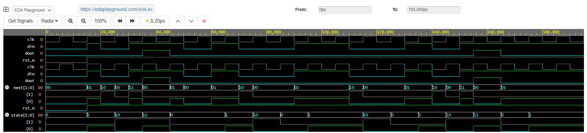

# 🔌 Day 36 – Moore FSM: "101" Sequence Detector (Non-Overlapping)

This is Day 36 of my **Verilog Coding Streak**, where I design, simulate, and analyze digital modules daily using **EDA Playground** with **Cadence Xcelium 23.09**.

## 📘 What I Built

I implemented a **Moore Finite State Machine (FSM)** to detect the bit sequence **"101"** in a serial data stream.

* The FSM is designed in a **non-overlapping** fashion, meaning once the sequence is detected, the FSM resets and waits for the next occurrence.
* Unlike the Mealy FSM (Day 35), the Moore FSM produces the output (`dout=1`) **based only on its states**, introducing a **1-cycle delay** in detection.

## 🧪 Testbench & Simulation

The testbench performs the following:

* Applies a serial input stream (`101101001`)
* Includes helper tasks to drive bit sequences into the FSM
* Uses `$monitor` and VCD dump (`moore.vcd`) for result validation
* Compares detection timing with the Mealy FSM for better understanding

## 📊 Results

### ✅ Output Summary (From Console & Waveform)

* Input: `101101001`
* Detections observed at positions 3 and 6
* Output (`dout=1`) occurs **one clock cycle later** compared to the Mealy FSM

### 📉 Waveform

The waveform confirms correct non-overlapping detection of the "101" sequence, with the expected **Moore one-cycle delay** compared to Mealy FSM.

---

## ▶️ Run the Code

Try it yourself on EDA Playground:
🔗 EDA Playground Link: [https://edaplayground.com/x/eLec](https://edaplayground.com/x/eLec)

---

## 📁 Project Structure

* `rtl/` – Moore FSM Verilog design (`moore_101_nonoverlap.sv`)
* `tb/` – Testbench (`moore_101_tb.sv`)
* `waveform/` – VCD files and simulation screenshots

## 🧠 Learnings

* **Moore FSMs** are more predictable since outputs depend **only on states**, not inputs.
* They offer **stable outputs** at the cost of **one-cycle detection latency**.
* Useful in synchronous systems and digital protocols where timing precision is critical.

## 📌 License

This project is for learning and open-source contribution. Feel free to fork, test, or use as a reference.

\#VLSI #Verilog #DigitalDesign #EDAPlayground #Cadence #RTLdesign #FSM #Moore #SequenceDetector #Semiconductor #CodingStreak
