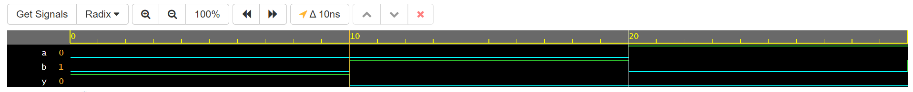

# 🚫 Day 3 – 2-Input NOR Gate

This project is part of my **Verilog Coding Streak**, where I design and simulate digital logic circuits every day using **EDA Playground** with **Cadence Xcelium 23.09**.


## 📘 Description

The focus for Day 3 is the **NOR gate** — a fundamental **universal gate** in digital electronics. The NOR gate outputs `1` only when **both inputs are `0`**. It's functionally the **inverse of the OR gate**.


## 🧪 What Was Done

- Created a 2-input NOR gate module in Verilog
- Designed a testbench to simulate all binary input cases exhaustively:
  - 00
  - 01
  - 10
  - 11
- Used `$monitor` to observe runtime signal behaviour
- Captured the waveform output via `.vcd` for validation


## 📊 Simulation Summary

### ✅ Console Output:
```

T=0  → a=0, b=0 → y=1
T=10 → a=0, b=1 → y=0
T=20 → a=1, b=0 → y=0
T=30 → a=1, b=1 → y=0

```

### 📉 Waveform Output



The waveform confirms correct NOR behaviour — output goes high **only** when both inputs are low.


## ▶️ Try It Yourself

- 🔗 [EDA Playground Link](https://edaplayground.com/x/if6G) 
- 📂 [GitHub Repo](https://github.com/mitanshigaur09/Verilog/tree/main/NOR%20Gate)


## 🗂 Project Structure

- `rtl/` – RTL module file(s)  
- `tb/` – Testbench file  
- `waveform/` – Simulation output screenshots and VCD

---

## 🧠 Takeaway

Today’s project reinforces the utility of **universal gates** in digital design. With NOR alone, any logical operation can be constructed, making it a critical building block in VLSI design.

---

## 📌 License

This project is released for learning and academic use under an open license.

---

#VLSI #Verilog #DigitalDesign #EDAPlayground #NORgate #HDL #Waveform #RTLDesign #Cadence #ASIC #FPGA #HardwareDesign #Simulation #VerilogStreak

