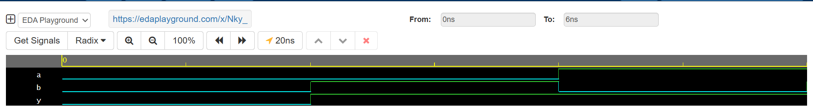

# Day 7 – OR Gate using NAND Gates (Verilog)

This repository is part of my **#VerilogCodingStreak**, where I implement and simulate various digital logic modules every day. On **Day 7**, I explored gate-level design by implementing a **2-input OR gate using only NAND gates**, demonstrating the universality of NAND gates.

## 🔧 Toolchain Used

- **Simulator**: Cadence Xcelium 23.09
- **Platform**: EDA Playground
- **Language**: Verilog HDL

---

## 📌 What This Includes

- OR gate implementation using only NAND gates.
- A complete testbench for functional simulation.
- VCD waveform file for timing and logic verification.
- Screenshot of waveform output.

---

## ✅ Observations

- The output is HIGH if either input is HIGH.
- Simulation results match the expected truth table.
- Successfully validated the OR logic using only NAND gates.

---

## 📎 Links

- ▶️ **EDA Playground**: https://edaplayground.com/x/Nky_
- 📂 **GitHub Repository**: https://github.com/mitanshigaur09/Verilog/tree/main/OR%20Gate%20using%20NAND

---

## 📈 Waveform Snapshot

---

## 🏁 What's Next?

Stay tuned as I move forward into more advanced modules like multiplexers, decoders, and sequential circuits in the upcoming days of the streak!

---

## 🔖 Tags

`#Verilog` `#ORgate` `#NANDlogic` `#DigitalDesign` `#EDAPlayground` `#CadenceXcelium` `#RTLDesign` `#CodingStreak`
