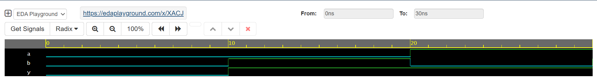

# 🔌 Day 1 – 2-Input OR Gate (Verilog)

This is Day 1 of my **Verilog Coding Streak**, where I design, simulate, and analyze digital logic modules daily using **EDA Playground** with **Cadence Xcelium 23.09**.

## 📘 What I Built

A simple **2-input OR gate** that performs logical OR on inputs `a` and `b`. The output is `1` whenever either or both inputs are `1`. This forms the basis of many larger combinational logic systems.

## 🧪 Testbench & Simulation

The testbench applied all possible input combinations:
- 00
- 01
- 10
- 11

Simulation was run using `$monitor` and the results were validated through both terminal output and waveform visualization.


## 📊 Results

### ✅ Output Summary (From Console)
```
T=0  → a=0, b=0 → y=0
T=10 → a=0, b=1 → y=1
T=20 → a=1, b=0 → y=1
T=30 → a=1, b=1 → y=1

```

### 📉 Waveform



The waveform clearly shows the correct output transitions according to the OR gate truth table.

---

## ▶️ Run the Code

Try it yourself on EDA Playground:  
🔗 EDA Playground Link: https://edaplayground.com/x/XACJ

---

## 📁 Project Structure

- `rtl/` – Contains the OR gate module  
- `tb/` – Contains the testbench  
- `waveform/` – Dumped VCD files and screenshots  

## 🧠 Learnings

Even a basic gate like OR is fundamental in digital logic. Validating simple modules builds confidence and ensures solid HDL practices before diving into complex designs like multiplexers, counters, or FSMs.

## 📌 License

This project is for learning and open-source contribution. Feel free to fork, test, or use as a reference.

#VLSI #Verilog #DigitalDesign #EDAPlayground #Cadence #RTLdesign #ORgate #Waveform #HardwareDesign #VerilogStreak #HDL

