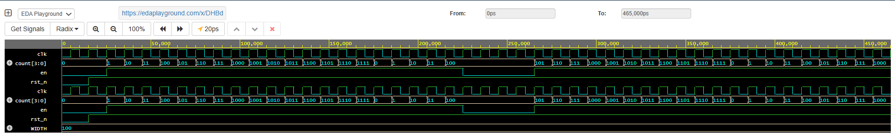

# 🔢 Day 33 – 4-bit Up Counter with Enable (Verilog)

This is Day 33 of my **Verilog Coding Streak**, where I design, simulate, and analyze digital logic modules daily using **EDA Playground** with **Cadence Xcelium 23.09**.

## 📘 What I Built

A **4-bit Up Counter** with an **enable signal** and an **active-low asynchronous reset (`rst_n`)**.

* When `en = 1`, the counter increments on each clock edge.
* When `en = 0`, the counter holds its value.
* When `rst_n = 0`, the counter resets immediately to `0000`.
* The counter naturally wraps around after reaching `1111` (i.e., `15 → 0`).

## 🧪 Testbench & Simulation

The testbench verified:

* Reset functionality at startup
* Continuous counting when `en = 1`
* Pause when `en = 0`
* Wrap-around behavior after `1111`

Simulation was monitored using `$monitor` and `$display`, and validated through both log outputs and waveform visualization.

## 📊 Results

### ✅ Output Summary (From Console)

```
Counter increments when en=1
Pauses when en=0
Resets immediately on rst_n=0
Wraps around naturally at 2^4 = 16
```

### 📉 Waveform



The waveform confirms correct counter operation, showing increment, hold, reset, and wrap-around behavior.

---

## ▶️ Run the Code

Try it yourself on EDA Playground:
🔗 EDA Playground Link: [https://edaplayground.com/x/DHBd](https://edaplayground.com/x/DHBd)

---

## 📁 Project Structure

* `rtl/` – Contains the counter module
* `tb/` – Contains the testbench
* `waveform/` – Dumped VCD files and screenshots

## 🧠 Learnings

Counters are fundamental in digital design, widely used in **timers, event counters, and FSM sequencing**. Adding an enable signal allows flexible control, while asynchronous reset ensures predictable startup behavior.

## 📌 License

This project is for learning and open-source contribution. Feel free to fork, test, or use as a reference.

\#VLSI #Verilog #DigitalDesign #EDAPlayground #Cadence #RTLdesign #CounterDesign #HardwareDesign #VerilogStreak #HDL
