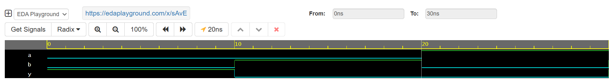

# XNOR Gate Simulation using Verilog 🧠🔧

Welcome to Day 5 of my **30-Day Verilog Coding Streak**!  
Today, I designed and simulated a **2-input XNOR Gate** using **Verilog HDL** on **EDA Playground** with the **Cadence Xcelium 23.09** tool.

---

## 🧪 Objective

To simulate a 2-input XNOR logic gate, observe waveform transitions, and verify its truth table behavior.

---

## 📁 Files

- `xnor_gate.v`: Verilog module describing the XNOR gate logic.
- `xnor_gate_tb.v`: Testbench to simulate different input combinations.

---

## ✅ Logic Description

**XNOR Logic:**  
```

Y = ~(A ^ B)

```

**Truth Table:**

| A | B | Y = XNOR(A,B) |
|---|---|----------------|
| 0 | 0 |       1        |
| 0 | 1 |       0        |
| 1 | 0 |       0        |
| 1 | 1 |       1        |

---

## 🧾 Simulation Output

### Console Output:
```

At time T=0,a=0,b=0,y=1
At time T=10,a=0,b=1,y=0
At time T=20,a=1,b=0,y=0
At time T=30,a=1,b=1,y=1

```

### Waveform:


---

## 🔗 EDA Playground Link

👉 [Run Simulation Here](https://edaplayground.com/x/Jxui)

---

## 🚀 Tools Used

- **EDA Playground**
- **Cadence Xcelium 23.09**
- **Verilog HDL**

---

## 📌 Connect with Me

Follow my journey and stay tuned for the next Day!  
🔗 [LinkedIn](https://www.linkedin.com/in/mitanshigaur/) | 💼 [GitHub](https://github.com/mitanshigaur)

---

⭐ *Thanks for reading. Feedback and suggestions are welcome!*
