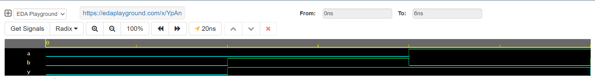

# Day 13 – Verilog Coding Streak 🚀

## Overview
On **Day 13** of my Verilog coding streak, I worked on designing and testing a **4-bit Priority Encoder**.  
The goal was to implement the encoder logic in Verilog and verify its functionality using a simulation waveform.

## Key Highlights
- Designed a **4-bit Priority Encoder** that outputs the binary representation of the highest-priority active input.
- Created a **testbench** to apply multiple input combinations and observe the encoder’s output.
- Verified results using **Cadence Xcelium** simulation on **EDA Playground**.
- Ensured proper waveform visualisation for input-output mapping.

## Learning Outcomes
- Strengthened understanding of **priority-based digital circuits**.
- Gained more practice in writing clean **testbenches**.
- Improved debugging and waveform interpretation skills.

## Tools Used
- **Verilog HDL**
- **Cadence Xcelium 23.09**
- **EDA Playground**

## Simulation Snapshot
Below are the snapshots from the simulation:

### Waveform Output

---

💡 **Next Step:** In Day 14, I plan to explore **combinational circuits with enable control** to expand functionality.
